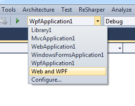

# SwitchStartupProject

A **Visual Studio extension** that allows you to quickly **select startup projects from a dropdown**.

No more scrolling up and down the solution explorer tree just to change the startup project!

## Features

* Select the startup project from a dropdown. (Like you do for the platform or configuration.)
* Switch between multi-project startup configurations. (e.g. [B and C] or [A, C and D])
* Configure command line arguments and other parameters for the startup projects.
* Compatible with Visual Studio 2017-2022

## Get it!

* Download the newest release on [Visual Studio Marketplace](https://visualstudiogallery.msdn.microsoft.com/f4e1be8c-b2dd-4dec-b273-dd88f8818571)
* Download release for VS 2017 on [Visual Studio Marketplace](https://visualstudiogallery.msdn.microsoft.com/9bbd5b32-6df8-4ae6-8a53-bcdd472c07ee)
* Download CI builds from [AppVeyor](https://ci.appveyor.com/project/thirteen/switchstartupproject)
* Source code on [GitHub](https://github.com/kemmis/switchstartupproject/tree/current)

## More Information
* [Configuration](Configuration.md)
* [Release Notes](ReleaseNotes.md)
* [License](LICENSE.md)

## Found a problem?

Use the [Issue Tracker](https://github.com/kemmis/switchstartupproject/issues)
